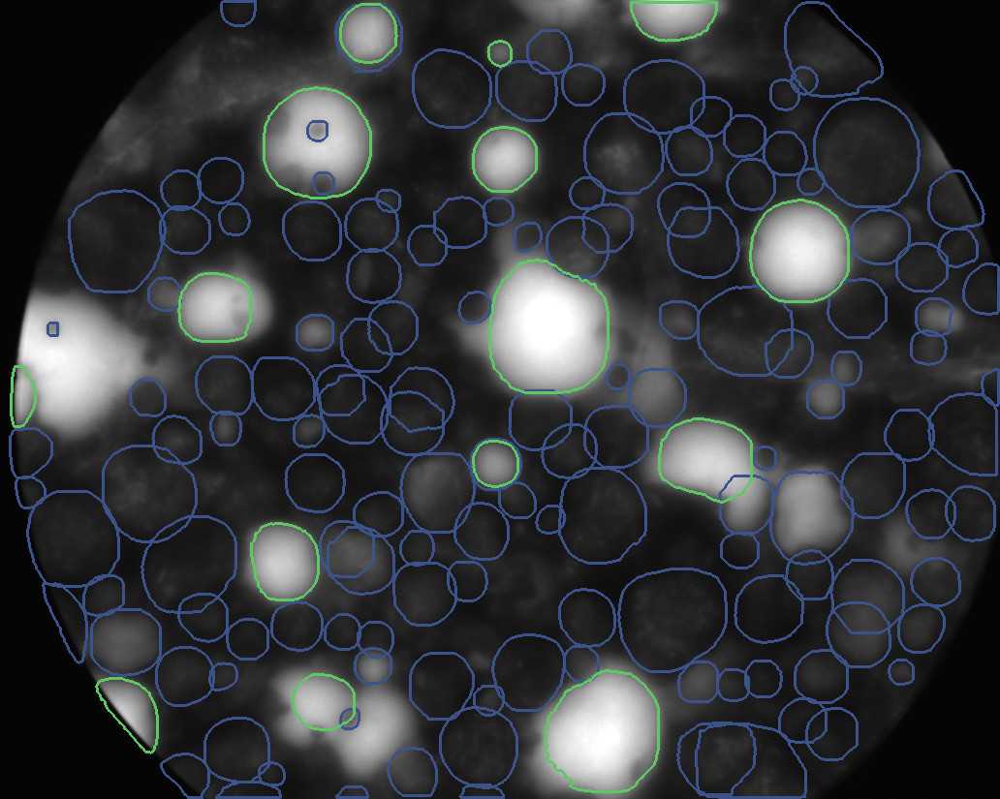

= ParticleMixtureAnalysis
image:https://img.shields.io/badge/DOI-10.3390/eng3010007-blue.svg[link="https://doi.org/10.3390/eng3010007"]
image:https://img.shields.io/github/license/maxfrei750/paddle.svg[link="https://github.com/maxfrei750/ParticleMixtureAnalysis/blob/master/LICENSE"]

This repository accompanies the following publication:

https://doi.org/10.3390/eng3010007[Frei, Kruis -- Image-Based Analysis of Dense Particle Mixtures via Mask R-CNN]

[cols="1a,1a"]
|===
| dark particles | light particles

| image::assets/psd_comparison_class_dark.png[Example PSD measurement for dark particles, 400]
| image::assets/psd_comparison_class_light.png[Example PSD measurement for light particles, 400]

| image::assets/psd_property_error_comparison_class_dark.png[Relative errors of the PSD measurement for dark particles, 400]
| image::assets/psd_property_error_comparison_class_light.png[Relative errors of the PSD measurement for light particles, 400]
|===

== Installation
. Install https://conda.io/en/latest/miniconda.html[conda] for your operating system.
. Open a command line.
. Clone this repository: `git clone --recurse-submodules https://github.com/maxfrei750/ParticleMixtureAnalysis.git`
. Change into the folder of the repository.
. Create a new conda environment: `conda env create --file external/paddle/environment.yaml`

== Training
. Download the https://github.com/maxfrei750/ParticleMixtureAnalysis/releases/download/v1.0/datasets.zip[`datasets.zip`] file and extract it at the project root.
. Activate the conda environment: `conda activate paddle`
. Run the training: `python train_model.py --config-dir=configs/MaskRCNN --config-name=MultiClassSynthetic400SyntheticValidation400Detections`
. The results of the inference can be found in the `logs` folder.

== Inference
. Download the https://github.com/maxfrei750/ParticleMixtureAnalysis/releases/download/v1.0/datasets.zip[`datasets.zip`] file and extract it at the project root.
. Either complete the training (see above) or download the https://github.com/maxfrei750/ParticleMixtureAnalysis/releases/download/v1.0/model.zip[`model.zip`] file and extract it at the project root.
. Activate the conda environment: `conda activate paddle`
. Run the model on a dataset: `python test_model_on_dataset.py MultiClassSynthetic400SyntheticValidation400Detections validation_real_merged_by_vote`
. The results of the inference can be found in the `output` folder.

== Citation
If you use this repository for a publication, then please cite it using the following bibtex-entry:

[source,bibtex]
----
@article{Frei.2022,
    author = {Frei, Max and Kruis, Frank Einar},
    year = {2022},
    title = {Image-Based Analysis of Dense Particle Mixtures via Mask R-CNN},
    url = {https://doi.org/10.3390/eng3010007}
}
----

